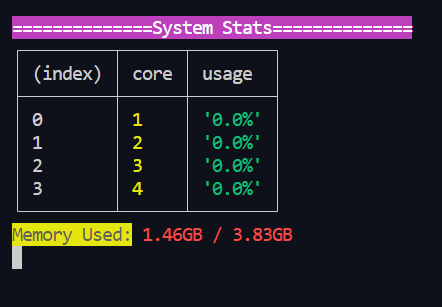

# 🖥️ Node.js System Monitor CLI Tool

A lightweight **Command Line Interface (CLI)** tool built using **Node.js** to monitor system performance in real time! 🚀

## 📦 Features

- 🧵 **Per-core CPU usage**  
- 🧠 **Memory usage (used vs total)**  
- ⏳ **System uptime**  
- 📊 Auto-refreshes every second  
- 🌈 Uses `chalk` for colorful terminal output  

---

## 📸 Screenshot


---

## 🛠️ How It Works

This tool uses:
- Node.js `os` module to fetch system info
- `chalk` to make output readable and colorful
- `setInterval` to auto-refresh stats every second

---

## 🚀 Usage

### 1. Clone the repo:
```bash
git clone https://github.com/dhirajaryaa/node-js-cli-system-moniter.git
cd system-monitor-cli
```

### 2. Install dependencies:
```bash
npm install
```

### 3. Run the monitor:
```bash
node system_monitor.js
```

---

## 📁 Sample Output

```
==============System Stats==============
┌─────────┬───────┬────────┐
│ (index) │ core  │ usage  │
├─────────┼───────┼────────┤
│    0    │   1   │ '12.5%'│
│    1    │   2   │ '15.3%'│
└─────────┴───────┴────────┘
Memory Used: 1.20GB / 3.98GB
System uptime: 48 minutes
```

---

## 🙌 Credits

Big thanks to [Rakesh K](https://www.linkedin.com/in/codersgyan) for his amazing Node.js tutorials!

---

## 🧠 Learnings

This project helped me:
- Understand system-level info in Node.js
- Work with timers and intervals
- Format CLI output for readability
- Start building real-world dev tools
